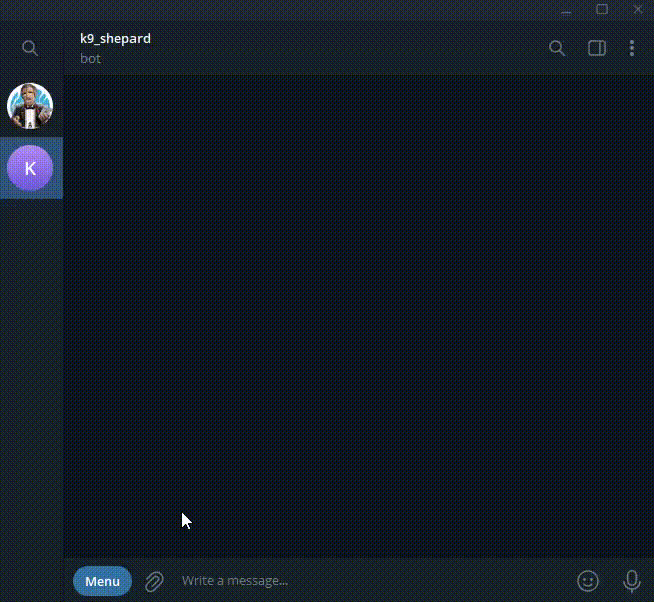

# 🐾 k9_shepard_bot

**k9_shepard_bot** is a simple Telegram bot built in Go that downloads Instagram videos when a user sends a reel or post URL. It uses [`yt-dlp`](https://github.com/yt-dlp/yt-dlp) under the hood for extracting and downloading video content.


##  🚀 Features

**/start** - get a bot greeting

Send an Instagram video URL to download. 

[@k9_shepard_bot](https://t.me/k9_shepard_bot)

<p align="center">

</p>


## ⚙️ Requirements

- Go 1.20+ installed on your system.
- yt-dlp installed on your system.
- A Telegram Bot Token (from [@BotFather](https://t.me/BotFather)).

##  🛠️ Installation

### 1. Clone the repository

```bash
git clone https://github.com/ipostnikov/kbot.git
cd kbot
```
### 2. Set your environment variable


```bash
 read -s TELE_TOKEN 
 ```
Enter Telegram bot token

```bash
 export TELE_TOKEN
 ```

### 3. Build

```golang
go build
```
### 4. Run the bot

```bash
./kbot start
```

## 💻 Development


- **cmd/**
    - **kbot.go** - *Contains command-line related implementations*
    - **root.go**  - *Root command configuration*
    - **version.go** - *Version command implementation*
    - **instagram.go** -  *Contains logic to download Instagram videos using yt-dlp*


## © License

This project is licensed under the MIT License - see the LICENSE file for details.